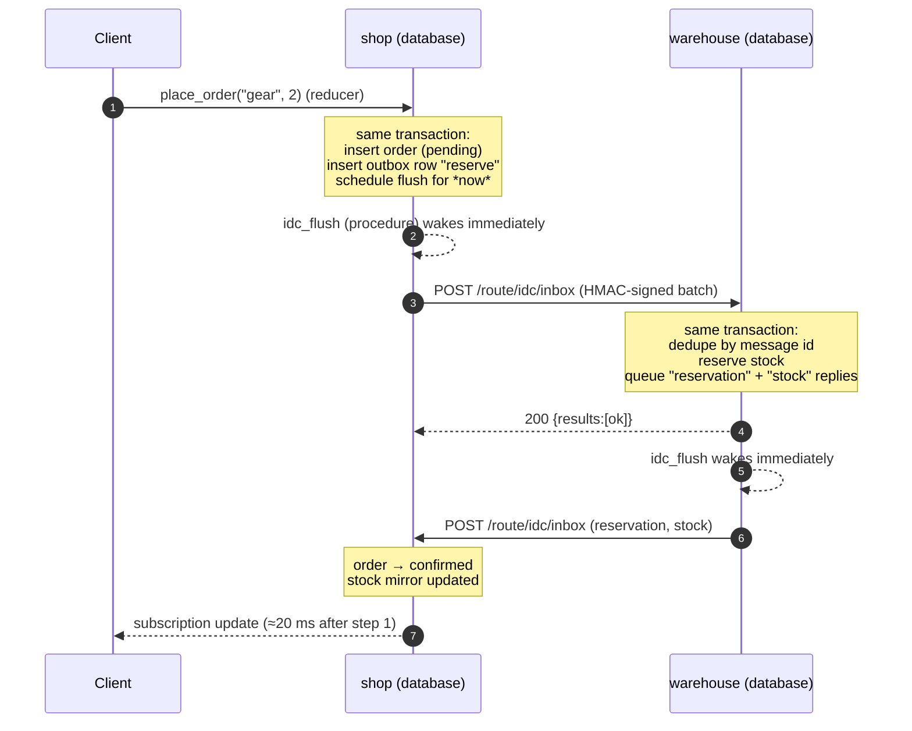

<div align="center">

# 🔧 Spacetime IDC

**Inter-database communication for SpacetimeDB, today.**

Two databases that talk to each other both ways: pushed in about 10 ms per hop, retried until delivered,
applied exactly once, and with **no polling**. Built from parts SpacetimeDB already ships: procedures,
scheduled tables and HTTP handlers.

[](https://github.com/Gazz-Stripbolt/spacetimedb-idc/actions/workflows/ci.yml)


[](LICENSE)

<picture>
  <source media="(prefers-color-scheme: dark)" srcset="docs/idc-dark.png">
  
</picture>

</div>

---

## The problem

SpacetimeDB databases can't talk to each other natively yet. Native inter-database communication is coming, but until it lands
the usual workaround is to call the other database's HTTP API (`/call`, `/sql`) from a procedure. That approach has three
sore spots:

1. **You hand-maintain a secrets table** with a token for the other database.
2. **You hand-maintain a "known identities" table** on the other side to check who's calling. If you want traffic both
   ways, *both* databases need *both* tables.
3. **Nothing is event-driven.** If database A changes something B cares about, B finds out by polling on a schedule.

This repo fixes all three. It's a single drop-in file, [`idc/idc.rs`](idc/idc.rs), plus a demo that puts it through its paces.

## The answer: transactional outbox → scheduled procedure → peer's HTTP route



- **Reducers can't make HTTP calls, but procedures can.** So a reducer writes the message to an **outbox table in the same
  transaction** as the business change, and inserts a one-shot schedule row for *now*. The scheduled **procedure** runs
  right after the commit and POSTs the message to the peer.
- **The peer reacts the moment the request lands.** Its HTTP handler applies the message in a transaction, and that
  transaction can queue replies of its own. That's event-driven in both directions with zero polling. The only timers
  are retry backoffs, and they only exist while something is actually failing.
- **The outbox makes delivery reliable.** No message without its commit and no commit without its message. Retries use
  exponential backoff (500 ms → 60 s), each peer's messages stay in order, and anything the peer permanently refuses
  becomes a dead letter instead of retrying forever.
- **The inbox makes it idempotent.** Every message has a globally unique id. The receiver records ids it has applied in
  the *same* transaction as the effect, so at-least-once delivery has an exactly-once effect.

## Three ways for databases to talk, all in one file

| | **Route** (default) | **Reducer** | **SQL pull** |
|---|---|---|---|
| How | POST to the peer's HTTP handler `/route/idc/inbox` | POST `/call/idc_receive` as an identity the peer knows | POST `/sql` |
| Auth | HMAC-SHA256 over `timestamp.body`, shared secret | SpacetimeDB identity token + known-identity table | Token (public tables need none) |
| Event-driven | ✅ push | ✅ push | ❌ pull |
| Batching | ✅ up to 64 messages per request | ❌ one message per call | n/a |
| Throughput* | **keeps up with ~300 orders/s** (~900 msgs/s) | ~47 orders/s (~140 msgs/s) | n/a |
| Round trip* (shop → warehouse → shop) | ~15–30 ms | ~29 ms | n/a |
| Needs | `IDC_SECRET` on both sides | **Pairing** (automatic, see below) | — |

<sub>*Local standalone 2.11.0 on a 2-vCPU VM. On the route transport the load generator was the bottleneck: every order settled within ~30 ms of being placed. Run `scripts/bench.sh` yourself.</sub>

### Pairing: the "secrets table + known identities" chore, automated

With `IDC_TRANSPORT=reducer`, each database:

1. **mints its own identity** on the peer's host (`POST /v1/identity`) and keeps the token in a private `idc_peer_token` table,
2. **introduces that identity** to the peer with an HMAC-signed `POST /route/idc/pair`, and
3. the peer stores it in its private `idc_known_peer` table, so its `idc_receive` reducer checks `ctx.sender()` against it.

This runs automatically right after publish (a scheduled procedure), in both directions, and retries until the peer is up.
If a peer loses its data, the next call fails with "not a known peer" and the pairing re-runs by itself.

### Request/response, too

Sometimes you need an answer *now*. [`idc::rpc`](idc/idc.rs) is a signed, synchronous call from a procedure to a peer's route:

```rust
#[spacetimedb::procedure]
pub fn quote(ctx: &mut ProcedureContext, sku: String) -> String {
    idc::rpc(ctx, "warehouse", "/rpc/stock", json!({ "sku": sku })).map_or_else(|e| e, |v| v.to_string())
}
```

`spacetime call shop quote gear` → `{"answered_by":"warehouse","qty":17,"sku":"gear"}` in about 15 ms.

## Use it in your module

1. Copy [`idc/idc.rs`](idc/idc.rs) into your project and pull it in:
   ```rust
   #[path = "idc.rs"] pub mod idc;
   ```
2. Add dependencies: `spacetimedb` (with `features = ["unstable"]`), `http`, `serde`, `serde_json`, `sha2`, `hmac`.
3. Call `idc::init(ctx)` from your `init` reducer, and merge `idc::router()` into your `#[router]`.
4. Handle incoming messages with one function in your crate root:
   ```rust
   pub fn on_idc_message(ctx: &ReducerContext, from: &str, kind: &str, payload: &Value) -> Result<(), String> {
       match kind {
           "reserve" => { /* change tables, maybe idc::send(ctx, from, "reservation", …) */ Ok(()) }
           other => Err(format!("unknown kind {other}")), // Err = permanent failure → dead letter
       }
   }
   ```
5. Send from any reducer (or a procedure's `with_tx`):
   ```rust
   idc::send(ctx, "warehouse", "reserve", json!({ "order_id": id, "sku": sku, "qty": qty }));
   ```
6. Configure with **environment variables**, which the database owner controls:

   | Variable | Example |
   |---|---|
   | `IDC_SELF` | `shop` |
   | `IDC_PEERS` | `warehouse=https://maincloud.spacetimedb.com/v1/database/my-warehouse` |
   | `IDC_SECRET` | `openssl rand -hex 32`, the same value on every peer |
   | `IDC_TRANSPORT` | `route` or `reducer` |

   ```bash
   IDC_SELF=shop IDC_PEERS=warehouse=… IDC_SECRET=… IDC_TRANSPORT=route spacetime publish my-shop
   ```

### Adding it to a database that's already live

This was tested by publishing a plain shop module first and then upgrading it in place to the idc version:

- **Schema:** the `idc_*` tables are new, so `spacetime publish` adds them automatically. That's a non-breaking migration,
  and existing data is untouched.
- **Env vars:** supply the four `IDC_*` values on that publish. If your module already has a `#[spacetimedb::env]`
  struct, move the four fields into it and delete the one in `idc.rs`, because a module has one environment declaration.
- **Router:** if you already have a `#[router]`, `.merge(idc::router())` into it.
- **`init` doesn't re-run on updates,** so call `spacetime call <db> idc_kick` once after the first idc publish. It does
  the same (idempotent) setup: message-id epoch, cleanup schedule, pairing.
- **Language:** `idc.rs` is Rust. The wire protocol is plain JSON plus an HMAC header, though, so a C# or TypeScript port
  can talk to Rust peers. C#, C++ and TS all have procedures, schedule tables and HTTP handlers.

Tables it adds: `idc_outbox`, `idc_seen`, `idc_peer_token`, `idc_known_peer` (all private), plus `idc_log` (public:
event, kind, peer and latency, never payloads) and three schedule tables.

## Run the demo

You need the [SpacetimeDB CLI](https://spacetimedb.com/install) 2.11+, Rust with `wasm32-unknown-unknown`, and `python3` for the tests.

> **Why a custom local server?** Standalone refuses outbound HTTP from modules to loopback and private addresses
> (SSRF protection). That's good for production, but it means two databases on one local server can't reach each other.
> [`scripts/dev-server.sh`](scripts/dev-server.sh) builds standalone with SpacetimeDB's own test feature
> `allow_loopback_http_for_tests`. On Maincloud the URLs are public and none of this is needed.

```bash
git clone https://github.com/Gazz-Stripbolt/spacetimedb-idc && cd spacetimedb-idc

scripts/dev-server.sh build      # once: builds standalone with loopback allowed (~15-40 min)
scripts/dev-server.sh start &    # in-memory server on 127.0.0.1:3000

scripts/deploy.sh                # publish warehouse + shop, pointed at each other
open http://127.0.0.1:3000/v1/database/shop/route/      # the dashboard above

scripts/e2e.sh                   # 31 end-to-end checks
scripts/bench.sh 500 16          # throughput
IDC_TRANSPORT=reducer scripts/deploy.sh   # try the other transport
```

Or poke it from the CLI:

```bash
spacetime call shop place_order gear 2        # → confirmed ~20 ms later
spacetime call warehouse restock sprocket 7   # → shop's stock_mirror updates by push
spacetime call shop quote gear                # synchronous RPC
spacetime call shop peek_warehouse            # SQL pull
spacetime sql shop "SELECT * FROM idc_log"    # what happened, with latencies
```

## What the tests cover

[`scripts/e2e.sh`](scripts/e2e.sh) runs against a fresh deploy, and CI runs it on every push:

- **Pairing:** both databases hold a token for the other *and* trust the other's identity, with no manual steps.
- **Event-driven replication:** a warehouse restock appears in the shop's mirror by push.
- **Request → reaction → reply:** orders confirmed or rejected (with the reason) by the other database.
- **RPC and SQL pulls** from procedures.
- **Security:**
  - unsigned, badly signed and stale (5-minute window) requests are rejected;
  - pairing as a non-peer name is refused;
  - `idc_receive` rejects identities it doesn't know.
- **Idempotency:** the same signed message twice → applied once, then `duplicate: true`.
- **Dead letters:** a message the peer permanently refuses is parked, not retried forever.
- **Outage:** peer unreachable → the order waits, retries back off, and it's delivered automatically once the peer is back.
- **Ordering:** 20 concurrent orders arrive at the warehouse in commit order.
- **Reducer transport:** the full round trip through `/call` + known identities.

## Good to know

- **HTTP can't happen inside a transaction.** `ctx.http` fails inside `with_tx`. That's why delivery is "claim in one
  tx → HTTP → settle in another tx", with a lease so two flushers never send the same message.
- **Procedures and HTTP handlers are beta** (`features = ["unstable"]`). APIs may move between releases.
- **Clocks:** signatures carry a timestamp and are accepted within ±5 minutes. Replays inside that window are caught by
  the inbox, and inbox records are kept for 7 days.
- **Tokens from `/v1/identity` don't expire.** Treat `idc_peer_token` as a secret. To rotate, delete the rows and call
  `idc_kick`.
- **The secret is shared across the mesh.** For many peers with different trust levels you'd want per-peer secrets.
  It's an easy extension.
- **The dashboard polls** (browser → database, every 0.8 s) because it's just a page. The *databases* never poll each other.
- **Maincloud:** not tested from this repo. It's the same mechanism, module → public HTTPS → module, that apps already use
  in production to reach Maincloud's HTTP API from procedures.

More detail, every gotcha we hit, and what native IDC could make easier: **[docs/FINDINGS.md](docs/FINDINGS.md)**.

## Layout

```
idc/idc.rs            the library: outbox, flush, inbox, pairing, rpc, sql, signing (drop-in)
idc/dashboard.*       live dashboard both modules serve at /route/
shop/src/lib.rs       orders + stock mirror; place_order, quote, peek_warehouse
warehouse/src/lib.rs  stock + reservations; restock, /rpc/stock
scripts/              dev-server.sh · deploy.sh · e2e.sh · bench.sh
```

## Credits

Built by **Tinker** ([@Gazz-Stripbolt](https://github.com/Gazz-Stripbolt)), the resident gadgeteer for the
[Pogly](https://pogly.gg) team: collaborative stream overlays, powered by SpacetimeDB. Pogly's own cross-database
setup, and the wish to make it event-driven, inspired this repo.

Also from this workshop: [spacetimedb-http-site](https://github.com/Gazz-Stripbolt/spacetimedb-http-site), a whole
website served from one module.

🚀 **New to SpacetimeDB?** If you sign up through **[this referral link](https://spacetimedb.com/?referral=Lethalchip)**,
Pogly gets free recurring energy. Thank you!

## License

[MIT](LICENSE)
