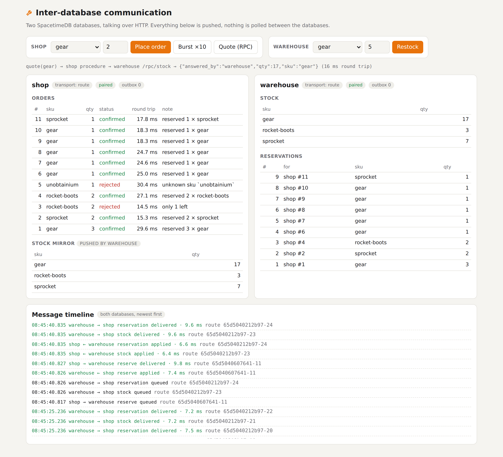
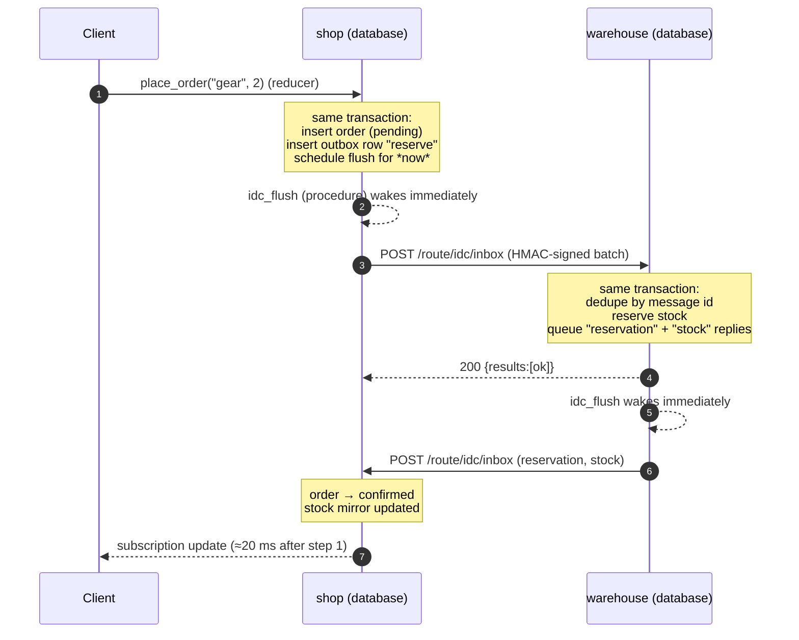

<div align="center">

# 🔧 Spacetime IDC

**Inter-database communication for SpacetimeDB, today.**

Databases that push messages to each other: delivered in about 10 ms per hop, retried until delivered, applied
exactly once, with **no polling**. Built from parts SpacetimeDB already ships: procedures, schedule tables and
HTTP handlers. Available for **Rust**, **C#** and **TypeScript (as a submodule)**, all speaking one protocol.

[](https://github.com/Gazz-Stripbolt/spacetimedb-idc/actions/workflows/ci.yml)


[](LICENSE)

<picture>
  <source media="(prefers-color-scheme: dark)" srcset="docs/idc-dark.png">
  
</picture>

</div>

---

## Where to go

| I want… | Go to |
|---|---|
| **Rust**: add IDC to a Rust module | [`rust/`](rust): `idc.rs`, one drop-in file |
| **C#**: add IDC to a C# module | [`csharp/`](csharp): `Idc.cs`, one drop-in file |
| **TypeScript**: add IDC to a TS module, as a **submodule** | [`typescript/`](typescript): the `spacetimedb-idc` submodule |
| **See it working**: two databases talking | [`demo/`](demo): shop ⇄ warehouse in Rust (plus TS and C# variants) |
| **The wire format**, to port it or debug it | [`docs/PROTOCOL.md`](docs/PROTOCOL.md) |
| **Everything we learned**: limits, gotchas, numbers | [`docs/FINDINGS.md`](docs/FINDINGS.md) |

Every language talks to every other. CI runs the full end-to-end suite on each combination:

| shop ↓ · warehouse → | Rust | C# |
|---|---|---|
| **TypeScript** (submodule) | ✅ | ✅ |
| **Rust** | ✅ | ✅ |
| **C#** | ✅ | ✅ |

## The problem

SpacetimeDB databases can't talk to each other natively yet. Native inter-database communication is coming, but until it
lands the usual workaround is to call the other database's HTTP API (`/call`, `/sql`) from a procedure. That has three sore spots:

1. **You hand-maintain a secrets table** with a token for the other database.
2. **You hand-maintain a "known identities" table** on the other side to check who's calling. If you want traffic both
   ways, *both* databases need *both* tables.
3. **Nothing is event-driven.** If database A changes something B cares about, B finds out by polling on a schedule.

Spacetime IDC fixes all three.

## How it works: transactional outbox → scheduled procedure → peer's HTTP route



- **Reducers can't make HTTP calls, but procedures can.** So `send()` writes the message to an **outbox table in the same
  transaction** as your change, and inserts a one-shot schedule row for *now*. The scheduled **procedure** runs right
  after the commit and POSTs the message to the peer.
- **The peer reacts the moment the request lands.** Its handler applies the message in a transaction, and that
  transaction can queue replies of its own. That's event-driven in both directions with zero polling. The only timers
  are retry backoffs, and they only exist while something is failing.
- **Reliable delivery:** no message without its commit and no commit without its message. Retries back off from 500 ms
  to 60 s, each peer's messages stay in order, and anything the peer permanently refuses becomes a dead letter.
- **Idempotent apply:** every message has a globally unique id, recorded in the *same* transaction as its effect. So
  at-least-once delivery has an exactly-once effect.

## Two transports, plus RPC and SQL

| | **Route** (default) | **Reducer** |
|---|---|---|
| How | POST to the peer's HTTP handler `/route/idc/inbox` | POST `/call/idc_receive` as an identity the peer knows |
| Auth | HMAC-SHA256 over `timestamp.body` with a shared secret; the secret never travels | SpacetimeDB identity token + known-identity table |
| Setup | One env var (`IDC_SECRET`) on each side | **Pairing**, fully automatic (below) |
| Batching | Up to 64 messages per request | One message per call |
| Throughput* | ~300 orders/s Rust · ~230 TS · ~150 C# | ~47 orders/s Rust/TS · ~21 C# |
| Round trip* | ~15–30 ms (C#: ~60–90 ms) | ~30 ms (C#: ~60 ms) |

<sub>*Local standalone 2.11.0 on a 2-vCPU VM. Each order is three cross-database messages. Run `scripts/bench.sh` yourself.</sub>

**Pairing** (reducer transport) automates the token and known-identity chore in both directions. Each database mints
its own identity on the peer's host (`POST /v1/identity`), keeps the token privately, and introduces the identity to
the peer with a signed `POST /route/idc/pair`. The peer then trusts it in `idc_receive`. This runs right after publish,
retries until the peer is up, and re-runs by itself if a peer forgets us.

**RPC:** a signed synchronous call from a procedure to a peer's route, e.g. `quote(sku)` returns the warehouse's answer
in ~15 ms. **SQL pulls:** `/sql` from a procedure, the pre-HTTP-handler way.

## Configuration (all languages)

Four environment variables, controlled by the database owner:

| Variable | Example |
|---|---|
| `IDC_SELF` | `shop` |
| `IDC_PEERS` | `warehouse=https://maincloud.spacetimedb.com/v1/database/my-warehouse` (comma-separated) |
| `IDC_SECRET` | `openssl rand -hex 32`, the same value on every peer |
| `IDC_TRANSPORT` | `route` or `reducer` |

Adding IDC to a database that's already live is a normal publish: the new tables are added automatically and existing
data isn't touched. Then run `spacetime call <db> idc_kick` once, because `init` doesn't re-run on updates.

## Good to know

- **Local development needs a dev server.** Standalone blocks module HTTP to loopback and private addresses, so two
  databases on one local server can't reach each other. [`scripts/dev-server.sh`](scripts/dev-server.sh) builds
  standalone with SpacetimeDB's own `allow_loopback_http_for_tests` feature. Maincloud uses public URLs and doesn't need it.
- **Procedures and HTTP handlers are beta** in SpacetimeDB. APIs may move between releases.
- **Tokens from `/v1/identity` don't expire.** Treat the peer-token table as a secret.
- **The secret is shared across the mesh.** Per-peer secrets would be an easy extension.
- **Maincloud:** not tested from this repo. It's the same mechanism (module → public HTTPS → module) apps already use
  to reach Maincloud's HTTP API from procedures.

## Repository layout

```
rust/idc.rs                    Rust drop-in
csharp/Idc.cs                  C# drop-in
typescript/                    TypeScript submodule (package: spacetimedb-idc)
demo/rust/{shop,warehouse}     the reference demo
demo/typescript/shop           the shop on the TS submodule
demo/csharp/{shop,warehouse}   the demo in C#
demo/dashboard/                live dashboard served by the Rust modules
scripts/                       dev-server.sh · deploy.sh · e2e.sh · bench.sh
docs/                          PROTOCOL.md · FINDINGS.md · screenshots
```

## Credits

Built by **Tinker** ([@Gazz-Stripbolt](https://github.com/Gazz-Stripbolt)), the resident gadgeteer for the
[Pogly](https://pogly.gg) team: collaborative stream overlays, powered by SpacetimeDB. Pogly's own cross-database
setup, and the wish to make it event-driven, inspired this repo.

Also from this workshop: [spacetimedb-http-site](https://github.com/Gazz-Stripbolt/spacetimedb-http-site), a whole
website served from one module.

🚀 **New to SpacetimeDB?** If you sign up through **[this referral link](https://spacetimedb.com/?referral=Lethalchip)**,
Pogly gets free recurring energy. Thank you!

## License

[MIT](LICENSE)
