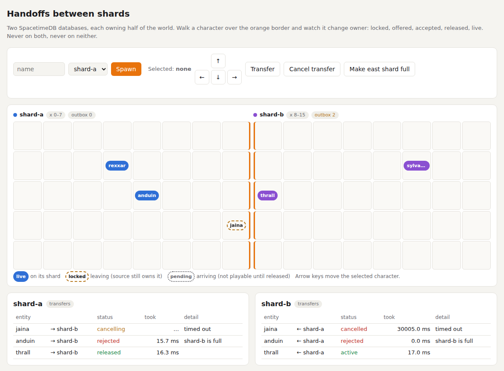
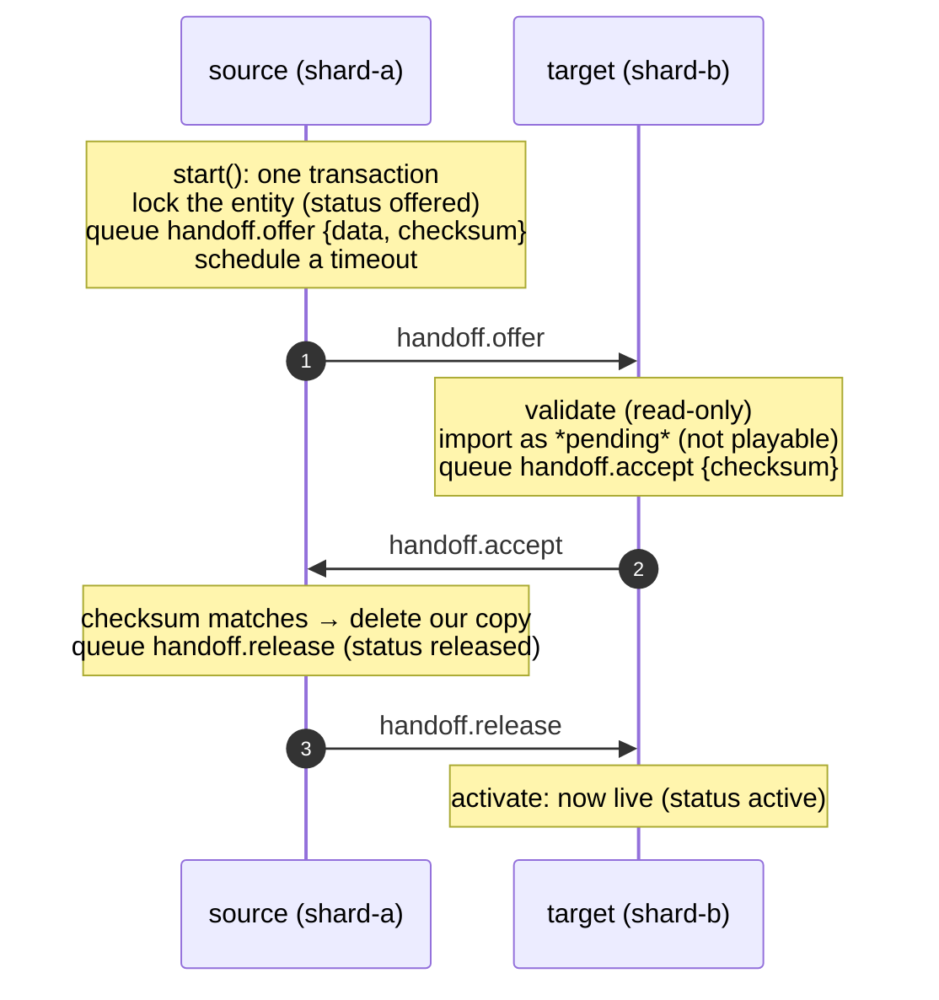

# Handoffs: moving an entity between databases safely

A character walks from one world shard to the next. An item moves from a player's inventory database to an auction
house. A tenant moves to another region. Each of these is the same problem: **one database must stop owning a thing
at the moment another one starts**, with no window where both own it (a dupe) or neither does (a loss).

Handoffs solve that on top of idc, in Rust ([`rust/handoff.rs`](../rust/handoff.rs)), C#
([`csharp/Handoff.cs`](../csharp/Handoff.cs)) and TypeScript ([`spacetimedb-idc/handoff`](../typescript/src/handoff.ts)).
All three use the same wire protocol, so any pairing can transfer.

<picture>
  <source media="(prefers-color-scheme: dark)" srcset="handoff-dark.png">
  
</picture>

## Why synchronous IDC alone isn't enough

The obvious approach is "copy to B, wait for B to say OK, then delete on A". With synchronous IDC (or our `rpc()`),
that's one procedure making an HTTP call. But a procedure's HTTP call happens **outside any transaction**, and there's
no transaction that spans two databases:

- B commits the copy, then A crashes before deleting: **duplicate** (the classic dupe exploit).
- A deletes first, then B fails: **lost character**.

Without distributed transactions (two-phase commit across databases, which SpacetimeDB doesn't have), the only safe
design is an **ownership state machine** where each step is one local transaction plus a durable message, every
message is idempotent, and every step is retried until it's done. That design is asynchronous by nature. Sync IDC
would only shave latency.

## The protocol



**Invariant: at most one live copy, and never zero copies.**

- Until A applies `accept`, A owns the entity. It's locked: your reducers check `is_locked` and refuse moves,
  trades and edits. B's copy is pending and can't be played.
- Once A applies `accept`, it deletes its copy and queues `release` **in the same transaction**. From then on the
  entity exists as B's pending copy plus a durable `release` in A's outbox, which idc retries until B applies it.
  Nothing is lost even if both databases crash right then.
- Every handler is idempotent: a replayed `offer`, `accept`, `release` or `cancel` (even with a fresh message id,
  so idc's own dedupe doesn't catch it) leaves the state unchanged.

### Failure paths

| What happens | Result |
|---|---|
| The target refuses (`validate` returns an error: name taken, shard full, bad data) | `handoff.reject {reason}`. The source unlocks the entity and calls `returned(reason)`. |
| The player or your code cancels | Only possible before the source has seen `accept`. The source sends `handoff.cancel` and stays locked. The target drops its pending copy (if any) and confirms with `handoff.cancelled`. Then the source unlocks. |
| No answer within the timeout (default 30 s) | Same as a cancel, with reason `timed out`. |
| Cancel and accept cross on the wire | idc keeps each peer's messages in order, so the target always sees `offer` before `cancel`. The target holds only a *pending* copy, so it can always honour the cancel. The source ignores the stray `accept` while it's cancelling. Both sides agree every time. |
| The target is down for a long time | The entity stays locked on the source until the target answers. That's the price of never duplicating: the source can't know whether the offer arrived. Once the target is back, the transfer completes or the cancel goes through. |
| `accept` carries the wrong checksum | The source cancels instead of releasing. |
| The data doesn't match the offer's checksum | The target rejects. |

### Statuses

Each side keeps one row per transfer in the public `handoff` table (no payloads):

| Side | Statuses |
|---|---|
| Source (`role = out`) | `offered` → `released`, or `offered` → `rejected`, or `offered` → `cancelling` → `cancelled` |
| Target (`role = in`) | `accepted` → `active`, or `accepted` → `cancelled`, or `rejected` |

Finished rows for an entity are cleared when it starts its next transfer, so the table stays about one row per entity.

## Using it

You provide six hooks and call `start` where an entity should leave. Use `is_locked` in your own reducers.

| Hook | Side | Must |
|---|---|---|
| `validate(from, entity, data)` | target | Be read-only. Return an error (Rust), a reason string (C#) or throw (TS) to refuse. |
| `import(from, entity, data)` | target | Store the entity as **pending**. Must not fail: check everything in `validate`. |
| `activate(entity)` | target | Make it live. Must not fail. |
| `discard(entity)` | target | Drop the pending copy (the transfer was cancelled). |
| `remove(entity)` | source | Delete your copy (the target has it). |
| `returned(entity, reason)` | source | The transfer failed and the entity is yours, unlocked. Tell the player. |

Why "must not fail": the hooks run inside the transaction that applies an idc message. If that transaction fails,
the sender treats the message as a permanent refusal (a dead letter). A dead `release` would leave an entity with no
live copy, so the protocol handlers never fail on purpose, and your hooks shouldn't either.

### Rust

```rust
pub mod handoff;   // next to idc.rs

#[spacetimedb::reducer(init)]
pub fn init(ctx: &ReducerContext) { idc::init(ctx); handoff::init(ctx); }

pub fn on_idc_message(ctx: &ReducerContext, from: &str, kind: &str, payload: &Value) -> Result<(), String> {
    if let Some(result) = handoff::on_idc_message(ctx, from, kind, payload) {
        return result;
    }
    // your own kinds...
}

// Leaving: lock and offer, in your reducer's transaction.
handoff::start(ctx, "shard-b", &name, &json!({ "name": name, "x": 8, "hp": c.hp, "gold": c.gold }))?;
handoff::cancel(ctx, &transfer_id, "changed my mind")?;
if handoff::is_locked(ctx, &name) { return Err("in transit".into()); }

// Hooks, in the crate root:
pub fn handoff_validate(ctx: &ReducerContext, from: &str, entity: &str, data: &Value) -> Result<(), String> { … }
pub fn handoff_import(ctx: &ReducerContext, from: &str, entity: &str, data: &Value) { … }
pub fn handoff_activate(ctx: &ReducerContext, entity: &str) { … }
pub fn handoff_discard(ctx: &ReducerContext, entity: &str) { … }
pub fn handoff_remove(ctx: &ReducerContext, entity: &str) { … }
pub fn handoff_returned(ctx: &ReducerContext, entity: &str, reason: &str) { … }
```

`start_with_timeout(ctx, peer, entity, data, Duration)` sets a custom timeout. `latest(ctx, entity)` returns the most
recent transfer row.

### C#

Add `Handoff.cs` next to `Idc.cs` (both compile into your `Module`):

```csharp
[SpacetimeDB.Reducer(ReducerKind.Init)]
public static void Init(ReducerContext ctx) { IdcInit(ctx); HandoffInit(ctx); }

public static partial void OnIdcMessage(IdcTx tx, IdcMessage msg)
{
    if (HandoffOnIdcMessage(tx, msg)) return;
    // your own kinds...
}

HandoffStart(ctx, "shard-b", name, data);                     // optional TimeSpan timeout
HandoffCancel(ctx, transferId, "changed my mind");
if (HandoffIsLocked(ctx, name)) throw new Exception("in transit");

public static partial string? HandoffValidate(IdcTx tx, string from, string entity, JsonNode data) { … } // null = accept
public static partial void HandoffImport(IdcTx tx, string from, string entity, JsonNode data) { … }
public static partial void HandoffActivate(IdcTx tx, string entity) { … }
public static partial void HandoffDiscard(IdcTx tx, string entity) { … }
public static partial void HandoffRemove(IdcTx tx, string entity) { … }
public static partial void HandoffReturned(IdcTx tx, string entity, string reason) { … }
```

The hooks are required partial methods, so a missing one is a compile error.

### TypeScript

The tables and the timeout job are part of the idc submodule, so there's nothing extra to mount:

```typescript
import * as idc from 'spacetimedb-idc';
import * as handoff from 'spacetimedb-idc/handoff';

const hooks: handoff.Hooks<Ctx> = {
  validate(tx, from, entity, data) { if (tx.db.character.name.find(entity)) throw new Error('name taken'); },
  import(tx, from, entity, data)   { tx.db.character.insert({ ...fromData(data), state: 'pending' }); },
  activate(tx, entity)             { /* state = 'live' */ },
  discard(tx, entity)              { /* delete if pending */ },
  remove(tx, entity)               { tx.db.character.name.delete(entity); },
  returned(tx, entity, reason)     { /* tell the player */ },
};

function onMessage(tx: Ctx, msg: idc.Message) {
  if (handoff.onIdcMessage(tx, msg, { scope: (c: Ctx) => c.as.idc, hooks })) return;
  // your own kinds...
}

handoff.start(ctx.as.idc, 'shard-b', name, data);             // optional timeoutMs
handoff.cancel(ctx.as.idc, transferId, 'changed my mind');
if (handoff.isLocked(ctx.as.idc, name)) throw new SenderError('in transit');
```

## The demo: two world shards

[`demo/*/shard`](../demo) is one strip of a game world, published twice: `shard-a` owns x 0–7, `shard-b` owns x 8–15.
Walk a character over the border and it's handed off. The Rust shard serves a live page at `/route/`.

```bash
scripts/deploy-shards.sh                                  # Rust ⇄ Rust
A_LANG=csharp B_LANG=typescript scripts/deploy-shards.sh  # any pairing: rust | csharp | typescript
open http://127.0.0.1:3000/v1/database/shard-a/route/

spacetime call shard-a spawn thrall
spacetime call shard-a step thrall 1 0                   # repeat until it crosses x = 8
```

## What the tests prove

[`scripts/handoff-e2e.sh`](../scripts/handoff-e2e.sh) runs 56 checks. Every scenario ends by checking the
invariant: each character is live on exactly one shard, nothing is locked or pending, and both outboxes are drained.

- **Crossing** the border both ways, with data intact and the character playable on arrival.
- **Locked in transit:** a locked character can't walk, trade, be traded with, or start a second transfer.
- **Concurrent double transfer:** three simultaneous attempts, exactly one wins.
- **Rejection:** name taken, shard full. The source unlocks and the player sees why.
- **Timeout during a partition:** the cancel waits behind the undelivered offer, the target imports and then discards,
  and the character stays home.
- **Cancel vs. accept race:** 20 transfers, each cancelled 15–300 ms after it starts. Some cross, some stay, and
  every one ends live in exactly one place.
- **Partitions between every step:** offer delivered but accept stuck (one locked + one pending, zero live), then
  accept delivered but release stuck (the source has let go, and the release is queued), then healed.
- **Replayed and forged messages** with fresh message ids: duplicate offer, release, cancel, accept and reject change
  nothing. A bad checksum is rejected. An offer the claimed source never sent stays pending, never live.
- **Unsafe mode refused:** with `IDC_DURABILITY=unsafe`, `start` refuses, and works again once it's back to `confirmed`.
- **Reducer transport** as well as the route transport.

[`scripts/handoff-crash.sh`](../scripts/handoff-crash.sh) runs the shards on an on-disk server and `kill -9`s the whole
server partway into a burst of 40 simultaneous transfers in each direction, then restarts it from disk. With
`SLOW_FSYNC_MS=200`, every fsync is delayed (via `strace`) to imitate a slow disk. After every round, every character
must be live on exactly one shard. Depending on where the kill lands, all transfers complete, all are cancelled, or
there's a mix.

This test earned its keep. The first version of the protocol passed everything else, then **duplicated characters in
CI** and **lost them all** under slow fsync. SpacetimeDB acknowledges a commit before it's durable, so a crash rolled
back transactions whose messages had already been delivered. idc now waits for durability on both ends (see
[FINDINGS](FINDINGS.md), gotcha 13), and the crash test holds in both modes.

CI runs the suite on six language pairings (each language with itself, and every mixed pair), plus both crash tests
on Rust ⇄ Rust. Locally, all nine directed pairings pass.

## Limits

- **A long outage keeps the entity locked.** The source can't tell "the offer never arrived" from "the target is
  about to accept", so it waits. An operator escape hatch (force-unlock on the source *and* purge on the target)
  could be added. It would need a human to confirm that the target never activated the entity.
- **After a crash, recovery can take up to a minute.** Messages that were in flight when the server died stay
  leased for 60 s (idc's `LEASE`), so a transfer whose timeout is shorter gets cancelled instead. That's safe, just
  slower.
- **Anyone with the mesh secret can forge an offer.** It's never activated without a matching `release` from the
  claimed source, but the pending copy sits there until it's cancelled. Same trust model as the rest of idc.
- **The entity data travels as JSON text,** with a SHA-256 over that exact text. Keep it small (it goes through one
  HTTP request). Big blobs belong in storage both sides can read.

## Native IDC later

Handoffs only depend on what idc offers: send a message in a transaction, at-least-once delivery, per-peer order,
and an idempotent receive. Native async IDC (planned upstream) provides the same contract, so the state machine
carries over unchanged: swap `idc::send` for the native send and the inbox for the native receive. If native IDC
doesn't guarantee per-peer ordering, the target needs one extra rule: a `cancel` that arrives before its `offer`
leaves a tombstone (the handlers already do this), and the late offer is ignored.
